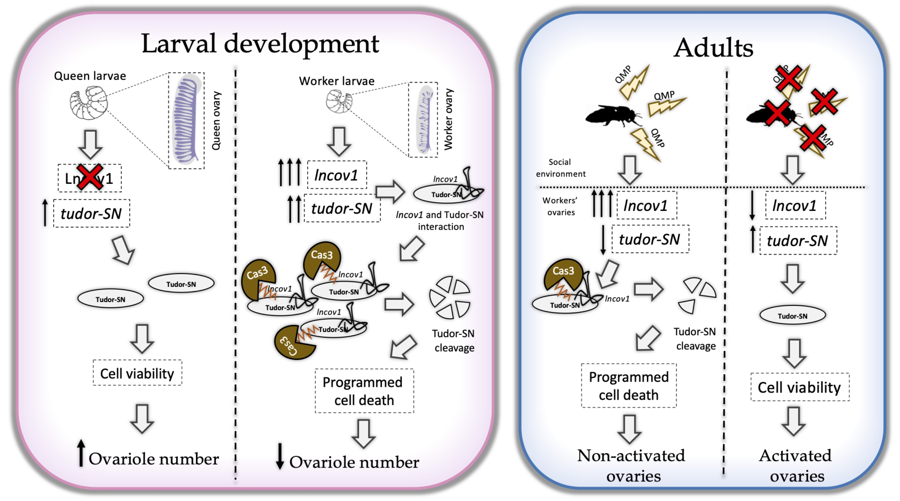

   

  

## Kallisto and Sleuth for Transcript-level Differential Expression Analysis

If we are interested in looking at splice isoform expression changes between groups, methods like DESeq2 are not recommended. Since it is more appropriate for gene differential expression. 
Therefore other methods can be used to quantify and identify transcript-level differential expression.  

So here, I will describe the pipeline we used for transcript quantification and transcript-level differential analysis used in our paper ["A long non-coding RNA is a key factor in the evolution of insect eusociality"](https://www.biorxiv.org/content/10.1101/2022.05.10.491402v1.full).  

* [kallisto](https://github.com/ziul-bio/lncov1_Transcriptome_Analysis/blob/main/1.0_transcriptomeAnalysis_kallisto_pipeline.md)-[sleuth](https://github.com/ziul-bio/lncov1_Transcriptome_Analysis/blob/main/2.2_sleuth.md)  

Kallisto is a method for quantification on the transcript (isoform) level, rather than the gene level. Kallisto quantifies a set of FASTA sequences, like a transcript representative genome. Thus it does not perform transcript assembly and it cannot quantify the expression of novel transcripts.  

Kallisto can be run in “bootstrap” mode to get uncertainty estimates for the expression levels - a kind of error bar for the quantification process. 
These bootstrap results are used downstream by sleuth to perform differential expression analysis of isoforms.  

## Objectives

* Quantification of transcripts-level expression.  

* Differencial expression analysis for all transcripts among the different experimental conditions.  

## Quick start

For a easy reproductibility of our work, I created the file [run_kallisto_pipeline.sh](https://github.com/ziul-bio/lncov1_Transcriptome_Analysis/blob/main/scripts/run_kallisto_pipeline.sh), as simple as 1 2 3, just run the code bellow. 

Note: -experiment is the experiment id of one of the studies used in this analysis. With the following code, the data will be downloaded and the quantification with kallisto will be performed. 

>>> git clone git@github.com:ziul-bio/lncov1_Transcriptome_Analysis.git
>>> bash run_kallisto_pipeline.sh -experiment GSE120561

Note: make sure you have kallisto and curl install before procede. 

---